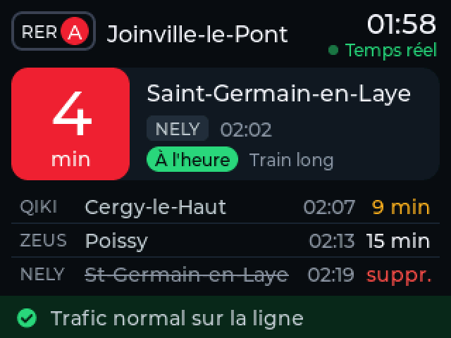
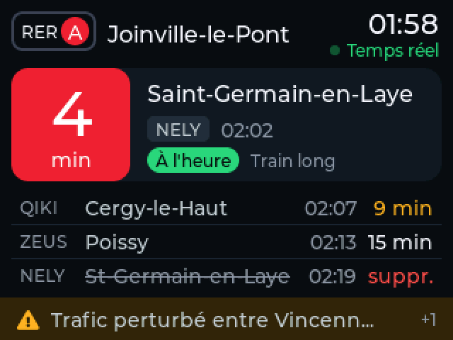
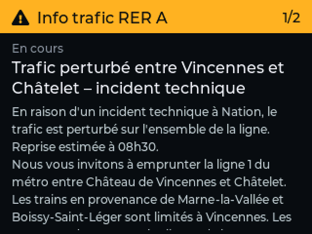
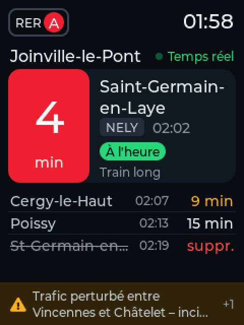

# RER A · Joinville-le-Pont → Auber

A small departure board for the ESP32 2.8" ST7789 touch display (the USB-C
"Cheap Yellow Display" / ESP32-2432S028 variant). It shows the next RER A trains
from **Joinville-le-Pont towards Paris (Auber)** plus **traffic disruptions**,
using the Île-de-France Mobilités **PRIM** API.

The UI is built with [LVGL 9](https://lvgl.io) and custom Montserrat fonts, so
French accents display properly. It works in landscape or portrait.

| Normal | Disruption | Details (tap) | Portrait |
|---|---|---|---|
|  |  |  |  |

*(Rendered from the real UI code with sample data, see [Tools](#tools-optional).)*

## What it does

* **Next train** in a large card: countdown in minutes, destination, mission
  code, departure time, status (on time / delayed / cancelled / at the
  platform), "Train long", and optionally your walking time to the station.
* **Following trains** below it: 3 in landscape, 4 in portrait.
* **Traffic footer**: green when the line runs normally, amber or red with the
  first message when it doesn't (`+1` means there are more).
* **Tap the screen** to open the traffic details: one page per message, and
  long messages scroll slowly. With no disruption, a "Trafic normal" page is
  shown. Tap again for the next page or to go back. It also returns to the
  board on its own after 30 s.
* **Small animations**: pages slide in, the countdown number rises into place
  when it changes, and the "Temps réel" dot pulses while data is live.

## Schedule & power

* **07:00 – 10:00** (configurable): screen on. Departures refresh every 30 s,
  traffic info every 3 min. The countdown ticks locally between refreshes and
  only changed pixels are redrawn. Wi-Fi stays in modem-sleep.
* **Rest of the day**: deep sleep with the panel asleep, the backlight latched
  off and Wi-Fi off. The board wakes silently at most every 2 h to resync the
  clock over NTP, then switches on at the start of the next window.
* **Touch the screen while it is asleep** to show the board for 5 minutes. Each
  tap restarts the 5 minutes. It also stays on 5 minutes after being plugged in.

Waking up by touch takes about 11 s before trains are shown: ~1 s boot, ~4 s
Wi-Fi (the access point's channel is remembered in RTC memory, so no scan is
needed) and ~6 s for the first HTTPS request. The clock is kept through deep
sleep and resynced in the background.

The ESP32 itself draws ~10 µA in deep sleep. The rest of the board (voltage
regulator, USB-serial chip, power LED) costs a few mA that software can't
remove. Rough estimate, not measured: ~150 mA with the screen on, 10–20 mA
asleep. That's well under 1 € of electricity per year.

## Setup

1. **Credentials**: copy `include/secrets.example.h` to `include/secrets.h` and
   fill in your Wi-Fi and your PRIM API key
   (prim.iledefrance-mobilites.fr → *Mon compte* → *Mes jetons d'authentification*).
   `secrets.h` is git-ignored.
2. **Settings** (optional): `include/config.h`, see below.
3. **Build & flash** with PlatformIO Core **≥ 6.2** (`pip install -U platformio`),
   **from PowerShell or cmd**. Git Bash doesn't work: ESP-IDF refuses to run under MSys.

   ```powershell
   pio run -t upload
   pio device monitor
   ```

   All toolchains and libraries live in `.pio-core/` and `.pio/` inside this
   folder (`core_dir` in `platformio.ini`), so nothing is installed system-wide.
   **The first build takes ~5 minutes**: PRIM only accepts TLS 1.3, which the
   prebuilt Arduino core doesn't enable. The build therefore uses the
   [pioarduino](https://github.com/pioarduino/platform-espressif32) platform,
   which recompiles the core with TLS 1.3 turned on (`custom_sdkconfig` in
   `platformio.ini`). Later builds take under a minute.

   If the upload doesn't start, hold **BOOT** while plugging in or pressing
   **RST**. The serial monitor prints each API call (`[departures] ok, 5 trains`).

## Settings (`include/config.h`)

| Setting | Default | What it does |
|---|---|---|
| `STATION_NAME`, `STOP_AREA_ID`, `LINE_ID` | Joinville-le-Pont, RER A | Station and line (IDFM referential IDs) |
| `EASTBOUND_DESTINATIONS` | Boissy, Marne-la-Vallée… | Destinations hidden from the board (the other direction) |
| `WALK_MINUTES` | `0` | Walking time to the station, shown next to the next train (0 = hidden) |
| `ACTIVE_START_MIN`, `ACTIVE_END_MIN` | 07:00 – 10:00 | When the screen is on |
| `ACTIVE_DAYS` | `0x7F` | Bitmask, bit 0 = Sunday. `0x3E` = weekdays only |
| `PEEK_SECONDS` | `300` | How long the board stays on after a touch outside the schedule |
| `MAX_SLEEP_S` | 2 h | Longest deep sleep before waking to resync the clock |
| `DEPARTURES_REFRESH_S`, `DISRUPTIONS_REFRESH_S` | 30 s, 3 min | Refresh rates (mind the PRIM quota) |
| `DEPARTURES_RETRY_S`, `DISRUPTIONS_RETRY_S` | 10 s, 30 s | Retry delay after a failed request |
| `HTTP_TIMEOUT_MS` | 15 s | Network timeout |
| `SCREEN_ROTATION` | `1` | 1 / 3 = landscape, 0 / 2 = portrait (each pair is rotated 180°) |
| `BACKLIGHT_LEVEL` | `170` | 0–255 |
| `TOUCH_PRESSURE_MIN` | `400` | Raise if the screen reacts on its own, lower if taps are missed |
| `DETAILS_TIMEOUT_S` | `30` | Details page closes after this long without a tap |
| `DETAILS_SCROLL_PAUSE_MS`, `DETAILS_SCROLL_MS_PER_PX` | 3 s, 40 ms/px | Scrolling of long traffic messages |
| `SHOW_ELEVATOR_OUTAGES` | `0` | Also show elevator / escalator messages |
| `CPU_FREQ_MHZ` | `240` | TLS 1.3 requests take about twice as long at 80 MHz |

## Troubleshooting

* **Colours look wrong**: ST7789 panels vary between batches. In `platformio.ini`:
  * red and blue swapped (the RER A disc looks blue) → `TFT_RGB_ORDER=TFT_RGB`
  * colours inverted (black background looks white) → `TFT_INVERSION_ON=1`
    instead of `TFT_INVERSION_OFF=1`
  * upside down → change `SCREEN_ROTATION` (1 ↔ 3 or 0 ↔ 2)
* **"Réseau : connection refused"**: the HTTPS connection failed. That
  usually means the server's certificate chain or TLS requirements changed;
  see `tools/make_certs.py` and the TLS note in Setup.
* **"Clé API refusée"**: the PRIM key in `secrets.h` is wrong or expired.
* **"Could not open COM3, the port is busy"**: close any serial monitor
  (VS Code, `pio device monitor`) before uploading.
* **"Failed to install Python dependencies into penv"**: the project's Python
  environment is damaged. Delete `.pio-core/penv` and build again.
* **Board reboots with `task_wdt` in the serial log**: something is hogging
  CPU 0. The network task runs at idle priority for that reason, so keep it there.

## How it works

| File | Role |
|---|---|
| `src/main.cpp` | Schedule, deep sleep, network task (core 0) / UI loop (core 1) |
| `src/net.cpp` | Wi-Fi (with remembered access point) and NTP |
| `src/prim_api.cpp` | PRIM calls, streaming JSON parsing with ArduinoJson filters |
| `src/ui.cpp` | LVGL screens (splash, board, traffic details), both orientations, animations |
| `src/hw.cpp` | ST7789 + LVGL glue, backlight PWM, bit-banged XPT2046 touch, sleep pins |
| `src/model.h` | Data shared between the network task and the UI |
| `src/text_utils.cpp` | HTML → text, accent folding, ISO-8601 parsing |
| `src/certs.h` | Google Trust Services roots for TLS verification of the PRIM server |
| `src/fonts/` | Generated fonts (Montserrat + a few FontAwesome icons, Latin-1) |
| `huge_app.csv` | Partition table (3 MB app), required by the pioarduino build |

**APIs used** (header `apikey: <PRIM key>`):

* Next departures (SIRI Lite):
  `GET /marketplace/stop-monitoring?MonitoringRef=STIF:StopArea:SP:43135:&LineRef=STIF:Line::C01742:`
  Westbound trains are kept by excluding eastbound destinations
  (`EASTBOUND_DESTINATIONS`). All westbound RER A trains from Joinville stop at Auber.
* Traffic info (Navitia line reports):
  `GET /marketplace/v2/navitia/line_reports/lines/line%3AIDFM%3AC01742/line_reports`
  limited to today. Elevator messages are hidden unless `SHOW_ELEVATOR_OUTAGES` is set.

IDs come from the IDFM open data referential: stop area `43135` = Joinville-le-Pont
(railStation), line `C01742` = RER A.

## Tools (optional)

* `tools/preview/build_preview.py`: compiles the real UI code on Windows with the
  installed Visual Studio and renders sample screens in both orientations to
  `.pio/preview/*.png` and `portrait_*.png`. Handy for tweaking the design
  without flashing. The screenshots above come from it.
* `tools/gen_fonts.sh`: regenerates `src/fonts/` (needs `lv_font_conv`,
  installed locally in `tools/fontgen`, see the script header). Edit
  `ICON_RANGE` there to add icons.
* `tools/make_certs.py`: regenerates `src/certs.h` if the server's CA changes.
